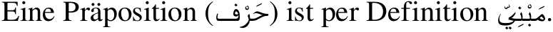

# Arabic

Arabic is available for `pdftex`, `xetex`, and `luatex`, but the
preferred engine is the latter, because of its unique features for
bidirectional texts, not requiring explicit mark up.

The recommended basic settings for a monolingual Arabic document in
`luatex` is (please, note your browser might not be rendering correctly
the source code):
```tex
\documentclass{article}

\usepackage[arabic, provide=*, bidi=basic, layout=counters.tabular]{babel}
\babelfont{rm}[Renderer=Harfbuzz]{FreeSerif}

\begin{document}

الموسيقى أو الموسيقا هي فن مؤلف من الأصوات والسكوت عبر فترة زمنية،
ويعتقد العلماء بأن كلمة الموسيقى يونانية الأصل، وقد كانت تعني سابقا
الفنون عموما غير أنها أصبحت فيما بعد تطلق على لغة الألحان فقط.

\end{document}
```


There is a complete example (with tables, columns, a figure, a
description, etc.) in the repository
([tex](https://github.com/latex3/babel/blob/main/samples/lua-arabic.tex), 
[pdf](https://github.com/latex3/babel/blob/main/samples/lua-arabic.pdf)).
It uses the tentative algorithm for justification with kashida.

## Counters

Numerals are best entered directly in the desired
form, but you may still need some conversion because LaTeX uses internally
the Western Arabic ones. With `luatex` there are two ways to map the
latter to the locale numerals, passed as option to `\babelprovide`:
* `maparabic` does it at the TeX level, by redefining `\arabic`. Note
  the form written to the auxiliary files is the converted one. It works
  with `xetex`, too.
* `mapdigits` does it at the engine level. This is
  usually the preferred method.
  
## Transliteration 

The transform `transliteration.dad` applies the transliteration system
devised by Yannis Haralambous for
[`dad`](http://mirrors.ctan.org/language/arabic/dad/dad-user-guide.pdf).
Not yet complete, but sufficient for many texts. 

This method to enter Arabic can be useful if you only need a few words
in this language:
```tex
\documentclass{article}

\usepackage[bidi=basic, ngerman]{babel}
\babelprovide[transforms = transliteration.dad]{arabic}
\babelfont{rm}{FreeSerif}

\begin{document}

Eine Präposition (\foreignlanguage{arabic}{Harof}) ist per
Definition \foreignlanguage{arabic}{maboniY+}.

\end{document}
```


## `pdftex`

Arabic support in `pdftex`is provided by the [external package
`arabi`](https://ctan.org/pkg/arabi), which has been devised for
documents written in Arabic.

For a few words or sentences in a non-Arabic document, you may prefer
to declare a language from scratch in the following way:
```tex
\usepackage[bidi=default, english]{babel}
\usepackage[LAE, T1]{fontenc}
\babelprovide{arabic}
\addto\extrasarabic{\fontencoding{LAE}\selectfont}
\addto\noextrasarabic{\fontencoding{T1}\selectfont}
```
Then `\foreignlanguage` and `\selectlanguage` can be used in the usual
manner, but very likely you will need some manual intervention (for
example, numerals). Sadly, with this procedure text cannot be
copy-pasted (and `cmap` works only to some extent).
 
## Useful links

* [Automatic enumerate list using eastern Arabic letters in beamer](https://tex.stackexchange.com/a/599846/5735)
* [Itemize environment in Arabic](https://tex.stackexchange.com/a/528562/5735)
* [Index not generated in an Arabic document](https://tex.stackexchange.com/a/506482/5735)
* [Right alignment for section and subsection in the table of contents](https://tex.stackexchange.com/a/587584/5735)
* [Understanding the starred version of \babelfont](https://tex.stackexchange.com/a/603925/5735)
* [Emphasizing Arabic text characters](https://tex.stackexchange.com/questions/528341/emphasizing-arabic-text-characters)


