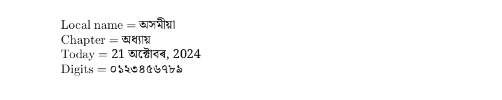

# Assamese

<blockquote>
  <p><em>Improve this page! Feel free to draft a pull request <a href="https://github.com/latex3/babel/tree/docs/docs">on GitHub</a>.<br>
  <a href="https://www.google.com/search?q=site%3Alatex3.github.io%2Fbabel+Assamese">Search this site for more on Assamese</a>.</em></p>
</blockquote>

This page offers basic guidance on typesetting a LaTeX document in the
Assamese language using the Bangla script.

## Support with `ini` locale file

Here is a minimal sample file with `assamese` as the main language
(assuming `luatex`, which is the recommended engine, and `babel` ≥24.14,
although it may work with previous versions).

```tex
\documentclass[assamese]{article}

\usepackage[provide=*]{babel}

\babelfont{rm}{Noto Serif Bengali}

% The next 2 lines make sure the Latin script is displayed.
\babelprovide[onchar=fonts letters]{english}
\babelfont[english]{rm}{NewComputerModern10}

\begin{document}

Local name $=$ অসমীয়া

Chapter $=$ \chaptername

Today $=$ \today

Digits $=$ \localenumeral{digits}{0123456789}

\end{document}
```



You may need download the font or replace it with another one in your
system.

## Contribute

If you are a native speaker or have expertise in this language, you can
contribute, make suggestion or request an enhancement by submitting a
pull request, opening an issue, or contacting the Babel maintainer with
the link above.