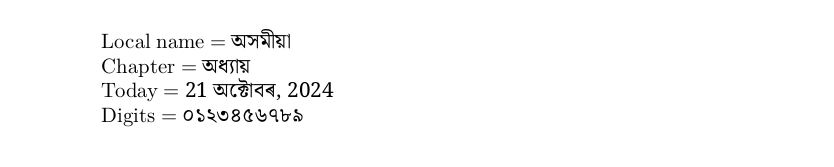

# Assamese

<blockquote>
  <p><em>Improve this page! Feel free to draft a pull request <a href="https://github.com/latex3/babel/tree/docs/docs">on GitHub</a>.<br>
  <a href="https://www.google.com/search?q=site%3Alatex3.github.io%2Fbabel+Assamese">Search this site for more on Assamese</a>.</em></p>
</blockquote>

This page offers basic guidance on typesetting a LaTeX document in the
Assamese language using the Bangla script.

## Support with `ini` locale file

Here is a minimal sample file with `assamese` as the main language
(assuming `luatex`, which is the recommended engine, and `babel` ≥25.2,
although it may work with previous versions).

```tex
\documentclass[assamese]{article}

\usepackage{babel}

\babelfont{rm}{Noto Serif Bengali}

\begin{document}

Local name $=$ অসমীয়া

Chapter $=$ \chaptername

Today $=$ \today

Digits $=$ \localenumeral{digits}{0123456789}

\end{document}
```


You may need download the font or replace it with another one in your
system.

## Calendar

The Indian National Calendar, named `indian`, is supported (`luatex` and
`xetex`). Here is an example setting `indian` as the default
calendar for `\today`.
```tex
\documentclass{article}

% Set a fixed day for this example
\year=2026 \month=8 \day=15

\usepackage[assamese, provide={calendar=indian}]{babel}
\babelfont{rm}{Noto Serif Bengali}

\begin{document}

\today

\end{document}
```

## Contribute

If you are a native speaker or have expertise in this language, you can
contribute, make suggestions or request enhancements by submitting a
pull request, opening an issue, or contacting the Babel maintainer with
the link above.