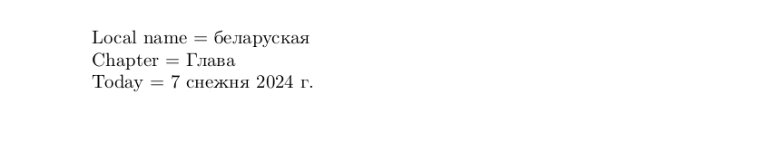

# Belarusian

<blockquote>
  <p><em>Improve this page! Feel free to draft a pull request <a href="https://github.com/latex3/babel/tree/docs/docs">on GitHub</a>.</em></p>
</blockquote>

This page offers basic guidance on typesetting a LaTeX document in the
Belarusian language using the Cyrillic script.

## Support with the traditional way (`ldf`)

The Belarusian language is supported in `babel` in the ‘classical’ way
based on a `ldf` file.See [babel-belarusian](https://ctan.org/pkg/babel-belarusian) for further details.

## Support with `ini` locale file

Here is a minimal sample file with `belarusian` as the main language
(assuming `luatex`, which is the recommended engine, and `babel` ≥24.14,
although it may work with previous versions).

```tex
\documentclass[belarusian]{article}

\usepackage[provide=*]{babel}

\babelfont{rm}{NewComputerModern10}

\begin{document}

Local name $=$ беларуская

Chapter $=$ \chaptername

Today $=$ \today

\end{document}
```



## Contribute

If you are a native speaker or have expertise in this language, you can
contribute, make suggestion or request an enhancement by submitting a
pull request, opening an issue, or contacting the Babel maintainer with
the link above.