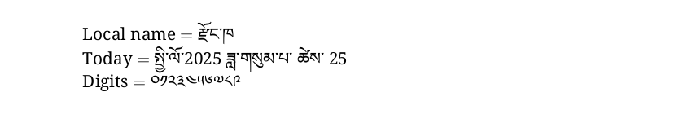

# Dzongkha

This page offers basic guidance on typesetting a LaTeX document in the
Dzongkha language using the Tibetan script.

## Support with `ini` locale file

Here is a minimal sample file with `dzongkha` as the main language, with `luatex`.

```tex
\documentclass[dzongkha]{article}

\usepackage[provide=*]{babel}

\babelfont{rm}[Renderer=Harfbuzz]{Noto Serif Tibetan}

% The next 2 lines make sure the Latin script is displayed.
\babelprovide[onchar=fonts letters]{english}
\babelfont[english]{rm}{NewComputerModern10}

\begin{document}

Local name $=$ རྫོང་ཁ

Today $=$ \today

Digits $=$ \localenumeral{digits}{0123456789}

\end{document}
```



You may need download the font or replace it with another one in your
system.