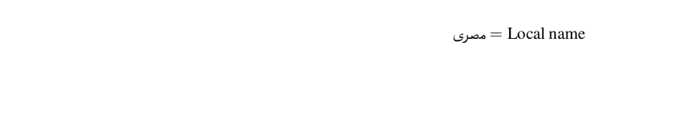

# Egyptian Arabic

<blockquote>
  <p><em>Improve this page! Feel free to draft a pull request <a href="https://github.com/latex3/babel/tree/docs/docs">on GitHub</a>.</em></p>
</blockquote>

This page offers basic guidance on typesetting a LaTeX document in the
Egyptian Arabic language using the Arabic script.

Masri or Colloquial Egyptian, with tag `arz`, different from
Standard Arabic as spoken in Egypt, with tag `ar-EG.`

## Support with `ini` locale file

Here is a minimal sample file with `egyptianarabic` as the main language
(assuming `luatex`, which is the recommended engine, and `babel` ≥25.2,
although it may work with previous versions).

```tex
\documentclass[egyptianarabic]{article}

\usepackage[provide=*,bidi=basic]{babel}

\babelfont{rm}{FreeSerif}

\begin{document}

Local name $=$ مصرى

\end{document}
```



## Contribute

If you are a native speaker or have expertise in this language, you can
contribute, make suggestions or request enhancements by submitting a
pull request, opening an issue, or contacting the Babel maintainer with
the link above.