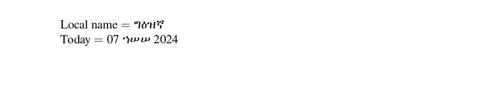

# Geez

<blockquote>
  <p><em>Improve this page! Feel free to draft a pull request <a href="https://github.com/latex3/babel/tree/docs/docs">on GitHub</a></em>.</p>
</blockquote>

This page offers basic guidance on typesetting a LaTeX document in the
Geez language using the Ethiopic script.

## Support with `ini` locale file

Here is a minimal sample file with `geez` as the main language
(assuming `luatex`, which is the recommended engine, and `babel` ≥24.14,
although it may work with previous versions).

```tex
\documentclass[geez]{article}

\usepackage[provide=*]{babel}

\babelfont{rm}{FreeSerif}

\begin{document}

Local name $=$ ግዕዝኛ

Today $=$ \today

\end{document}
```

