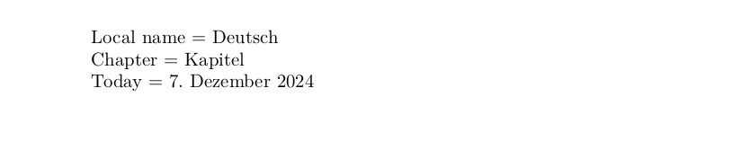
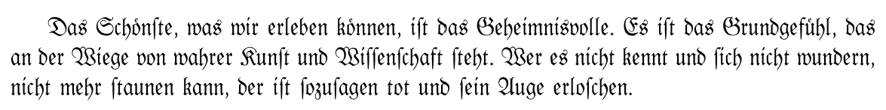

# German

<blockquote>
  <p><em>Improve this page! Feel free to draft a pull request <a
  href="https://github.com/latex3/babel/tree/docs/docs">on GitHub</a><br>
    <a
    href="https://www.google.com/search?q=site%3Alatex3.github.io%2Fbabel+German">Search this site for more on German</a>.</em></p>
</blockquote>

This page offers basic guidance on typesetting a LaTeX document in the
German language using the Latin script.

Please, bear in mind the ‘traditional’ styles for German based on ‘ldf’
files don’t currently conform the `babel` [naming
conventions](locale-naming.md). Oddly, the name `german` refers to the
pre-1996 orthography, while the current one is selected with `ngerman`
(`n` comes from ‘new’, which was certainly the case about 30 years
ago). Also, the Unicode CLDR calls `swisshighgerman` the locale with
tag `de-CH`, because [`swissgerman`](locale-swissgerman.md) is another
language (with tag `gsw`). To summarize:

| Unicode CLDR | ldf | ini |
| --- | --- |
| German | `ngerman` | `german` |
| German (Traditional German orthography) | `german` | `german-traditional` |
| Austrian | `naustrian` | `austrian` |
| Austrian  (Traditional German orthography) | `naustrian` | `austrian-traditional` |
| Swiss High German | `nswissgerman` | `swisshighgerman` |

## Support with the traditional way (`ldf`)

The German language is supported in `babel` in the ‘classical’ way
based on a `ldf` file. See
[babel-german](https://ctan.org/pkg/babel-german) for further details.

## Support with `ini` locale file

Here is a minimal sample file with `german` as the main language
(assuming `luatex`, which is the recommended engine).

```tex
\documentclass[german]{article}

\usepackage[provide=*]{babel}

\begin{document}

Local name $=$ Deutsch

Chapter $=$ \chaptername

Today $=$ \today

\end{document}
```



## Long s (ſ)

The transform `longs.unifraktur` implements the basic heuristic
rules for the long s (ſ) from those in [Unifraktur
Maguntia](https://unifraktur.sourceforge.net/) (which are also used in
[Yannis Fraktur Regular](https://ctan.org/pkg/yfonts-otf)), excluding a
large set specific to this font. An example follows (from Einstein).
The font has been picked somewhat
randomly. See [What's new in babel
25.5](https://latex3.github.io/babel/news/whats-new-in-babel-25.5.html)
for further details.

```tex
\documentclass{article}

\usepackage[german]{babel}
\babelprovide[transforms=longs.unifraktur]{german}
\babelfont{rm}{Kabinett-Fraktur}

\begin{document}

Das Schönste, was wir erleben können, ist das Geheimnisvolle. Es ist
das Grundgefühl, das an der Wiege von wahrer Kunst und Wissenschaft
steht. Wer es nicht kennt und sich nicht wundern, nicht mehr staunen
kann, der ist sozusagen tot und sein Auge erloschen.

\end{document}
```


## Contribute

If you are a native speaker or have expertise in this language, you can
contribute, make suggestion or request an enhancement by submitting a
pull request, opening an issue, or contacting the Babel maintainer with
the link above.