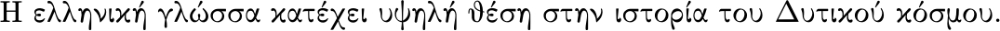

# Greek

The Greek language is available for `pdftex`, `xetex`, and `luatex`.
Depending on your needs you may prefer the `ldf` file, currently
supported by Günter Milde, or the `ini` files.

The support for `pdftex` is based on the non-standard `LGR` encoding,
which may be a source of issues (see for example
[here](https://tex.stackexchange.com/questions/548584/ascii-text-set-in-greek-script-when-using-usepackagegreekbabel)).
It’s strongly recommended to use `xetex`  or `luatex`.

## As `ldf`

It supports Monotonic, Polytonic and Ancient Greek, but only one at a
time. A minimal preamble with Monotonic Greek and `pdftex` is:
```tex
\usepackage[LGR]{fontenc}
\usepackage[greek]{babel}
```

With `pdftex` it is advisable, as in the example, to load explicitly the font
encoding (the `greek` style does it if necessary, but in a non-standard
way). With `xetex` and `luatex`, `fontspec` must not be loaded.

## As `ini`

This method is available for `xetex` and `luatex` (it might work with
`pdftex`, but it has not been extensively tested). It supports
Monotonic, Polytonic and Ancient Greek, which can be used at the same
time. A minimal example with Monotonic and `xetex` or `luatex` is:
```tex
\documentclass{article}

\usepackage[greek, provide=*]{babel}
\babelfont{rm}{NewComputerModern10}

\begin{document}

Η ελληνική γλώσσα κατέχει υψηλή θέση στην ιστορία του Δυτικού κόσμου.

\end{document}
```


The default names for the other variants are `polytonicgreek` and
`ancientgreek`.

There is a full example in Polytonic Greek in the repository
([tex](https://github.com/latex3/babel/blob/main/samples/lua-polygreek.tex),
[pdf](https://github.com/latex3/babel/blob/main/samples/lua-polygreek.pdf)):


## Counters

With the `ini` method and if the locale has been explicitly requested,
a macro is defined, `\greeknumeral{number}`, which converts the number
to Ionian (alphabetic) form, as represented by the original babel
`greek` style, and with the same upper limit (999999). However, the
code has been rewritten from scratch, and now it’s fully expandable.
There are three macros to customize it, which are redefined with
`\renewcommand`:
* `\BabelGreekNumeralMarkerEnd`: 1 argument with the generated number >999; by default it is #1ʹ.
* `\BabelGreekNumeralMarker`: 1 argument with the whole number; by default is #1, ie, do nothing, but you may add an overline.
* `\BabelGreekNumeralMiriads`: 4 arguments, with the digits above 9999, ie, 1234 if the number is 12345678 (padded with zeroes if necessary); note by default `\greeknumeral` does not accept such large numbers, but you may redefine it to use, for example, the M representation.

In the `ini` file itself, which means they are available even if loaded
on the fly, the following ‘locale’ counters are defined (see the
explanation in the `babel` manual about `\localecounter` and
`localenumeral`): `lower.modern`, `upper.modern`, `lower.ancient`,
`upper.ancient` (in Ancient Greek, only the latter). There are some
limitations, because they aren’t directly configurable and the upper
limit is 9999.

## Hyphenation

_Only luatex_. The transform `diaeresis.hyphen` removes the diaeresis
above iota and upsilon if hyphenated just before. It works with the
three variants.

## Transliteration 

_Only luatex_. The transform `transliteration.omega` applies the
transliteration system devised by Yannis Haralambous for the Omega
system. Although the provided combinations are not exactly the same (a
few are currently missing), this transform follows its syntax: `=` for
the circumflex, `v` for digamma, and so on. For better compatibility
with Levy’s system, `~` (as ‘string’) is an alternative to `=`. The
character `'` is tonos in Monotonic Greek, but oxia in Polytonic and
Ancient Greek.

This transliteration system does not convert the sigma at the end of a
word (on purpose). The transform `sigma.final` does it. To prevent the
conversion (an abbreviation, for example), write `"s`.

A way to make `~` a valid character for the circumflex is:
```tex
\defineshorthand{~}{\string~}
```
This declaration applies to the whole document, but if you prefer to
preserve the default meaning in other languages, you can write:
```tex
\AddBabelHook[greek]{el-short}{afterextras}{\languageshorthands{greek}}
\defineshorthand[greek]{~}{\string~}
```

## Useful links

* [Getting started with Greek and Hebrew in LuaLaTeX](https://tex.stackexchange.com/questions/65141/getting-started-with-greek-and-hebrew-in-lualatex/620541#620541)
* [How to change the name Figure to greek Εικόνα](https://tex.stackexchange.com/questions/612386/how-to-change-the-name-figure-to-greek-%ce%95%ce%b9%ce%ba%cf%8c%ce%bd%ce%b1/614286#614286)
* [Can one combine ancient and modern Greek with Babel?](https://tex.stackexchange.com/questions/294828/can-one-combine-ancient-and-modern-greek-with-babel/614278#614278)
* [Use of Greek language without \textlatin{} \textgreek{} each word](https://tex.stackexchange.com/questions/579780/use-of-greek-language-without-textlatin-textgreek-each-word/579813#579813)
* [Fontspec / Babel support to some .otf features](https://tex.stackexchange.com/questions/544773/fontspec-babel-support-to-some-otf-features)
* [Writing in Ancient Greek with babel](https://tex.stackexchange.com/questions/584397/writing-in-ancient-greek-with-babel)

