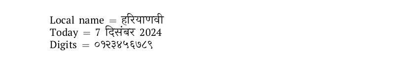

# Haryanvi

This page offers basic guidance on typesetting a LaTeX document in the
Haryanvi language using the Devanagari script.

## Support with `ini` locale file

Here is a minimal sample file with `haryanvi` as the main language, with `luatex`.

```tex
\documentclass[haryanvi]{article}

\usepackage[provide=*]{babel}

\babelfont{rm}[Renderer=Harfbuzz]{Shobhika}

\begin{document}

Local name $=$ हरियाणवी

Today $=$ \today

Digits $=$ \localenumeral{digits}{0123456789}

\end{document}
```

