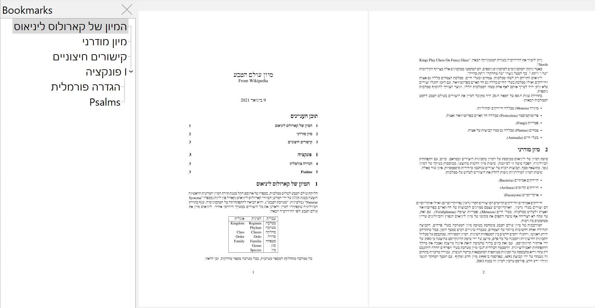

# Hebrew

The Hebrew language is available for `pdftex`, `xetex`, and `luatex`, but the
preferred engine is the latter, because of its unique features for
bidirectional texts, not requiring explicit mark up.

<iframe width="560" height="315" src="https://www.youtube.com/embed/eWZhWOzrVTA" title="YouTube video player" frameborder="0" allow="accelerometer; autoplay; clipboard-write; encrypted-media; gyroscope; picture-in-picture" allowfullscreen></iframe>

There is a complete example (with a table, a footnote, maths, etc.) in the repository
([tex](https://github.com/latex3/babel/blob/main/samples/lua-hebrew.tex), 
[pdf](https://github.com/latex3/babel/blob/main/samples/lua-hebrew.pdf)).

For `pdftex` you may need to install separately the [`culmus`
package](https://www.guyrutenberg.com/culmus-latex/), which is usually
not included in TeX distributions.

## Useful links

* [Tables with Hebrew text using
  babel](https://tex.stackexchange.com/questions/558939/tables-with-hebrew-text-using-babel)
* [Hebrew name
  typesetting](https://tex.stackexchange.com/a/581010/5735)
* [Help getting started with Hebrew in babel](https://tex.stackexchange.com/questions/138992/help-getting-started-with-hebrew-in-babel/611604#611604)
* [Why aren’t dageshes aligned in Hebrew in LuaLaTex?](https://tex.stackexchange.com/questions/605202/why-arent-dageshes-aligned-in-hebrew-in-lualatex)
* [Writing Biblical Hebrew texts with different coloring for consonants, vowel and accent signs](https://tex.stackexchange.com/a/632620/5735)

