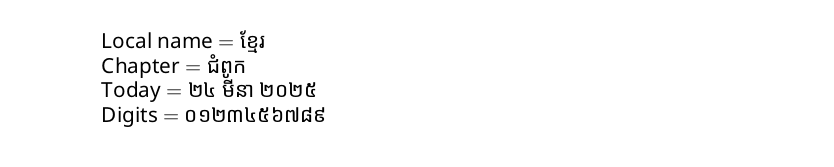

# Khmer

<blockquote>
  <p><em>Improve this page! Feel free to draft a pull request <a href="https://github.com/latex3/babel/tree/docs/docs">on GitHub</a>.</em></p>
</blockquote>

This page offers basic guidance on typesetting a LaTeX document in the
Khmer language using the Khmer script.

See also [How to write Khmer language in
Latex](https://stackoverflow.com/a/79855740/8303149).

## Support with `ini` locale file

Here is a minimal sample file with `khmer` as the main language
(assuming `luatex`, which is the recommended engine, and `babel` ≥25.2,
although it may work with previous versions).

```tex
\documentclass[khmer]{article}

\usepackage[provide=*]{babel}

\babelfont{rm}{Noto Sans Khmer}

\begin{document}

Local name $=$ ខ្មែរ

Chapter $=$ \chaptername

Today $=$ \today

Digits $=$ \localenumeral{digits}{0123456789}

\end{document}
```


You may need download the font or replace it with another one in your
system.

## Contribute

If you are a native speaker or have expertise in this language, you can
contribute, make suggestions or request enhancements by submitting a
pull request, opening an issue, or contacting the Babel maintainer with
the link above.