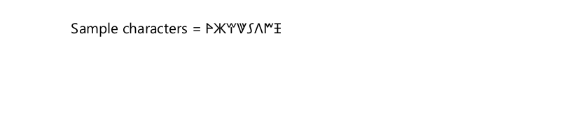

# Lycian

<blockquote>
  <p><em>Improve this page! Feel free to draft a pull request <a href="https://github.com/latex3/babel/tree/docs/docs">on GitHub</a>.</em></p>
</blockquote>

This page offers basic guidance on typesetting a LaTeX document in the
Lycian language using the Lycian script.

## Support with `ini` locale file

Here is a minimal sample file with `lycian` as the main language
(assuming `luatex`, which is the recommended engine, and `babel` ≥25.2,
although it may work with previous versions).

Segoe UI Historic is a Windows font.

```tex
\documentclass[lycian]{article}

\usepackage[provide=*]{babel}

\babelfont{rm}{Segoe UI Historic}

\begin{document}

Sample characters = 𐊀𐊌𐊘𐊙𐊖𐊍𐊃𐊑

\end{document}
```



## Contribute

If you are a native speaker or have expertise in this language, you can
contribute, make suggestions or request enhancements by submitting a
pull request, opening an issue, or contacting the Babel maintainer with
the link above.