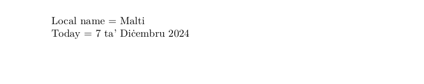

# Maltese

This page offers basic guidance on typesetting a LaTeX document in the
Maltese language using the Latin script.

## Support with `ini` locale file

Here is a minimal sample file with `maltese` as the main language, with `luatex`.

```tex
\documentclass[maltese]{article}

\usepackage[provide=*]{babel}

\begin{document}

Local name $=$ Malti

Today $=$ \today

\end{document}
```

