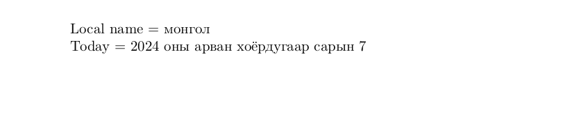

# Mongolian

This page offers basic guidance on typesetting a LaTeX document in the
Mongolian language using the Cyrillic script.

## Support with the traditional way (`ldf`)

The Mongolian language is supported in `babel` in the ‘classical’ way
based on a `ldf` file.

## Support with `ini` locale file

Here is a minimal sample file with `mongolian` as the main language, with `luatex`.

```tex
\documentclass[mongolian]{article}

\usepackage[provide=*]{babel}

\babelfont{rm}{NewComputerModern10}

\begin{document}

Local name $=$ монгол

Today $=$ \today

\end{document}
```

