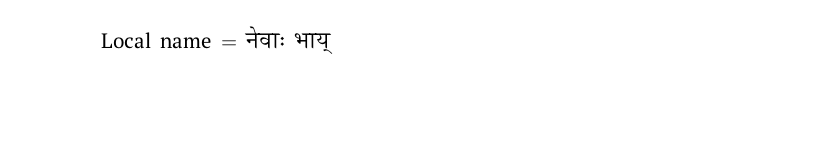

# Newari

This page offers basic guidance on typesetting a LaTeX document in the
Newari language using the Devanagari script.

## Support with `ini` locale file

Here is a minimal sample file with `newari` as the main language, with `luatex`.

```tex
\documentclass[newari]{article}

\usepackage[provide=*]{babel}

\babelfont{rm}[Renderer=Harfbuzz]{Shobhika}

\begin{document}

Local name $=$ नेवाः भाय्

\end{document}
```

