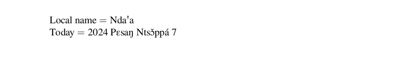

# Ngomba

This page offers basic guidance on typesetting a LaTeX document in the
Ngomba language using the Latin script.

## Support with `ini` locale file

Here is a minimal sample file with `ngomba` as the main language, with `luatex`.

```tex
\documentclass[ngomba]{article}

\usepackage[provide=*]{babel}

\begin{document}

Local name $=$ Ndaꞌa

Today $=$ \today

\end{document}
```

