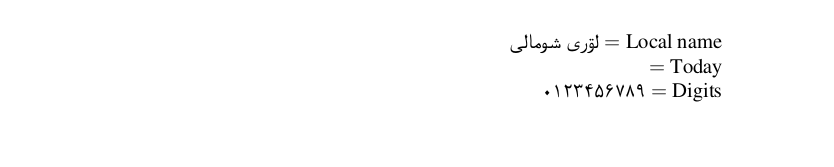

# Northern Luri

This page offers basic guidance on typesetting a LaTeX document in the
Northern Luri language using the Arabic script.

## Support with `ini` locale file

Here is a minimal sample file with `northernluri` as the main language, with `luatex`.

```tex
\documentclass[northernluri]{article}

\usepackage[provide=*,bidi=basic]{babel}

\babelfont{rm}[Renderer=Harfbuzz]{FreeSerif}

\begin{document}

Local name $=$ لۊری شومالی

Today $=$ \today

Digits $=$ \localenumeral{digits}{0123456789}

\end{document}
```

