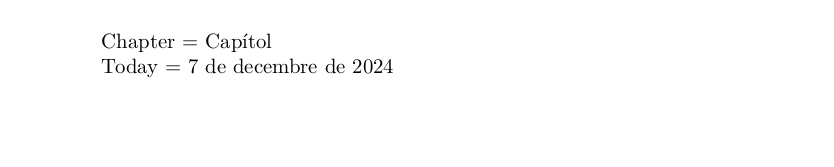

# Occitan

This page offers basic guidance on typesetting a LaTeX document in the
Occitan language using the Latin script.

## Support with the traditional way (`ldf`)

The Occitan language is supported in `babel` in the ‘classical’ way
based on a `ldf` file. See [babel-occitan](https://ctan.org/pkg/babel-occitan)
for further details.

## Support with `ini` locale file

Here is a minimal sample file with `occitan` as the main language, with `luatex`.

```tex
\documentclass[occitan]{article}

\usepackage[provide=*]{babel}

\begin{document}

Chapter $=$ \chaptername

Today $=$ \today

\end{document}
```

