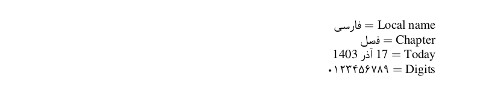

# Persian

<blockquote>
  <p><em>Improve this page! Feel free to draft a pull request <a href="https://github.com/latex3/babel/tree/docs/docs">on GitHub</a>.<br>
  <a href="https://www.google.com/search?q=site%3Alatex3.github.io%2Fbabel+Persian">Search this site for more on Persian</a>.</em></p>
</blockquote>

This page offers basic guidance on typesetting a LaTeX document in the
Persian language using the Arabic script.

Although `xetex` is not recommended anymore, you can have a look at
[xepersian](https://ctan.org/pkg/xepersian?lang=en) and
[arabxetex](https://ctan.org/pkg/arabxetex), too. For `luatex`, see
[arabluatex](https://ctan.org/pkg/arabluatex).

## Support with `ini` locale file

Here is a minimal sample file with `persian` as the main language
(assuming `luatex`, which is the recommended engine, and `babel` ≥24.14,
although it may work with previous versions).

```tex
\documentclass[persian]{article}

\usepackage[provide=*,bidi=basic]{babel}

\babelfont{rm}{FreeSerif}

\begin{document}

Local name $=$ فارسی

Chapter $=$ \chaptername

Today $=$ \today

Digits $=$ \localenumeral{digits}{0123456789}

\end{document}
```



## Contribute

If you are a native speaker or have expertise in this language, you can
contribute, make suggestion or request an enhancement by submitting a
pull request, opening an issue, or contacting the Babel maintainer with
the link above.