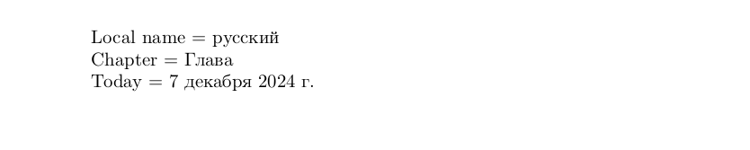

# Russian

<blockquote>
  <p><em>Improve this page! Feel free to draft a pull request <a href="https://github.com/latex3/babel/tree/docs/docs">on GitHub</a><br>
  <a
  href="https://www.google.com/search?q=site%3Alatex3.github.io%2Fbabel+Russian">Search this site for more on Russian</a>.</em></p>
</blockquote>

This page offers basic guidance on typesetting a LaTeX document in the
Russian language using the Cyrillic script.

## Support with the traditional way (`ldf`)

The Russian language is supported in `babel` in the ‘classical’ way
based on a `ldf` file.See [babel-russian](https://ctan.org/pkg/babel-russian) for further details.

## Support with `ini` locale file

Here is a minimal sample file with `russian` as the main language
(assuming `luatex`, which is the recommended engine, and `babel` ≥24.14,
although it may work with previous versions).

```tex
\documentclass[russian]{article}

\usepackage[provide=*]{babel}

\babelfont{rm}{NewComputerModern10}

\begin{document}

Local name $=$ русский

Chapter $=$ \chaptername

Today $=$ \today

\end{document}
```



## Trasliteration

A transform is provided for the transliteration of Russian using the
norm GOST 7.79-2000 System B, named `transliteration.gost779b`. It
requires only ASCII characters and is reversible. See the [news page for
v.
25.10](https://latex3.github.io/babel/news/whats-new-in-babel-25.10.html).

## Contribute

If you are a native speaker or have expertise in this language, you can
contribute, make suggestion or request an enhancement by submitting a
pull request, opening an issue, or contacting the Babel maintainer with
the link above.