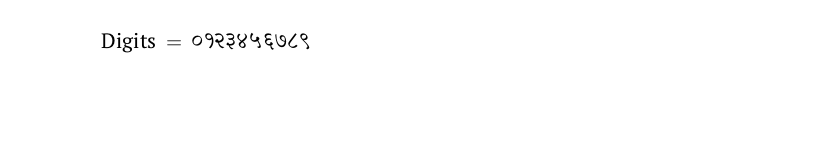
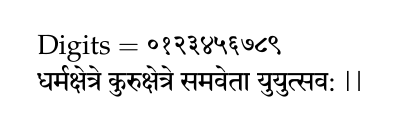
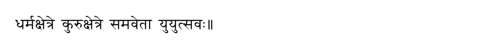

# Sanskrit

<blockquote>
  <p><em>Improve this page! Feel free to draft a pull request <a href="https://github.com/latex3/babel/tree/docs/docs">on GitHub</a>.<br>
  <a href="https://www.google.com/search?q=site%3Alatex3.github.io%2Fbabel+Sanskrit">Search this site for more on Sanskrit</a>.</em></p>
</blockquote>

This page offers basic guidance on typesetting a LaTeX document in the
Sanskrit language using the Devanagari script.

## Support with `ini` locale file

Here is a minimal sample file with `sanskrit` as the main language
(assuming `luatex`, which is the recommended engine, and `babel` ≥24.14,
although it may work with previous versions). 

With TeXLive versions prior to 2026 you may need to add `provide=*` as
a package option.

```tex
\documentclass[sanskrit]{article}

\usepackage{babel}

\babelfont{rm}{Shobhika}

\begin{document}

Digits $=$ \localenumeral{digits}{0123456789}

\end{document}
```



## More fonts

Shobhika is bundled with TeXLive, but there are many other fonts, although not
all of them properly support Sanskrit. The following example uses
[Sanskrit
2020](https://sourceforge.net/projects/advaita-sharada-font/files/Devanagari/).
The example has been typeset with `xelatex`, but the result is the same
with `lualatex`:
```tex
\documentclass[sanskrit]{article}

\usepackage{babel}

\babelfont{rm}{Sanskrit 2020}

\begin{document}
    
Digits $=$ \localenumeral{digits}{0123456789}
    
धर्मक्षेत्रे कुरुक्षेत्रे समवेता युयुत्सव:   ||
    
\end{document}
```



Alternatives are Siddhanta (also in TeXLive, but you may need to move
the `ttf` file), [Tiro Devanagari
Sanskrit](https://fonts.google.com/specimen/Tiro+Devanagari+Sanskrit), 
[Adishila](https://adishila.com/fonts/) or
[Chandas](http://www.sanskritweb.net/cakram/),
among others.

## Transliterations and other transforms

(_lualatex_) `Babel` provides transforms for the Harvard-Kyoto and IAST
tranliterations, named `transliteration.hk` and `transliteration.iast`.
Here is an example with the latter:
```tex
\documentclass[sanskrit]{article}

\usepackage[provide={transforms=transliteration.iast}]{babel}

\babelfont{rm}{Siddhanta}
\begin{document}

dharmakṣetre kurukṣetre samavetā yuyutsavaḥ//
    
\end{document}
```


Very often danda and doble danda are entered as vertical bars (i.e.,
`|` and `||`). You can define easily if necessary a couple of transforms
to get the actual Devanagari characters (order is relevant!):
```tex
\babelprehyphenation{sanskrit}{ {007C}{007C} }{ string = ॥ }
\babelprehyphenation{sanskrit}{ {007C} }{ string = । }
```
(Since `|` has a special meaning in transforms, it’s entered by its
Unicode value.)

## Contribute

If you are a native speaker or have expertise in this language, you can
contribute, make suggestion or request an enhancement by submitting a
pull request, opening an issue, or contacting the Babel maintainer with
the link above.