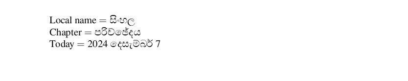

# Sinhala

<blockquote>
  <p><em>Improve this page! Feel free to draft a pull request <a href="https://github.com/latex3/babel/tree/docs/docs">on GitHub</a>.<br>
  <a href="https://www.google.com/search?q=site%3Alatex3.github.io%2Fbabel+Sinhala">Search this site for more on Sinhala</a>.</em></p>
</blockquote>

This page offers basic guidance on typesetting a LaTeX document in the
Sinhala language using the Sinhala script.

## Support with `ini` locale file

Here is a minimal sample file with `sinhala` as the main language
(assuming `luatex`, which is the recommended engine, and `babel` ≥24.14,
although it may work with previous versions).

```tex
\documentclass[sinhala]{article}

\usepackage[provide=*]{babel}

\babelfont{rm}{FreeSerif}

\begin{document}

Local name $=$ සිංහල

Chapter $=$ \chaptername

Today $=$ \today

\end{document}
```



## Contribute

If you are a native speaker or have expertise in this language, you can
contribute, make suggestion or request an enhancement by submitting a
pull request, opening an issue, or contacting the Babel maintainer with
the link above.