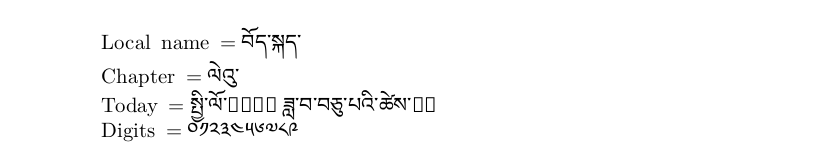

# Tibetan

<blockquote>
  <p><em>Improve this page! Feel free to draft a pull request <a href="https://github.com/latex3/babel/tree/docs/docs">on GitHub</a>.<br>
  <a href="https://www.google.com/search?q=site%3Alatex3.github.io%2Fbabel+Tibetan">Search this site for more on Tibetan</a>.</em></p>
</blockquote>

This page offers basic guidance on typesetting a LaTeX document in the
Tibetan language using the Tibetan script.

## Support with `ini` locale file

Here is a minimal sample file with `tibetan` as the main language
(assuming `luatex`, which is the recommended engine, and `babel` ≥25.2,
although it may work with previous versions).

```tex
\documentclass[tibetan]{article}

\usepackage[provide={mapdigits}]{babel}

\babelfont{rm}{Noto Serif Living}

\begin{document}

Local name $=$ བོད་སྐད་

Chapter $=$ \chaptername

Today $=$ \today

Digits $=$ \localenumeral{digits}{0123456789}

\end{document}
```


You may need download the font or replace it with another one in your
system.

## Justification (luatex)

Tentative justification based on lines padded with tshegs is available.
See [What’s new in babel
3.81](https://latex3.github.io/babel/news/whats-new-in-babel-3.81.html).
As a complement, see [this
answer](https://github.com/latex3/babel/issues/250#issuecomment-1632744901)
to an issue.

Note with `xetex` justification with padding tshegs is not possible,
and without them the result is not completely correct. This is a
limitation of the engine.

## Contribute

If you are a native speaker or have expertise in this language, you can
contribute, make suggestions or request enhancements by submitting a
pull request, opening an issue, or contacting the Babel maintainer with
the link above.