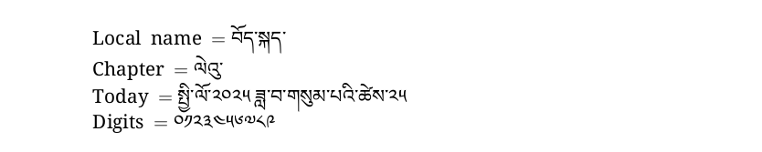

# Tibetan

<blockquote>
  <p><em>Improve this page! Feel free to draft a pull request <a href="https://github.com/latex3/babel/tree/docs/docs">on GitHub</a></em>.</p>
</blockquote>

This page offers basic guidance on typesetting a LaTeX document in the
Tibetan language using the Tibetan script.

## Support with `ini` locale file

Here is a minimal sample file with `tibetan` as the main language
(assuming `luatex`, which is the recommended engine, and `babel` ≥24.14,
although it may work with previous versions).

```tex
\documentclass[tibetan]{article}

\usepackage[provide={mapdigits}]{babel}

\babelfont{rm}{Noto Serif Tibetan}

% The next 2 lines make sure the Latin script is displayed.
\babelprovide[onchar=fonts letters]{english}
\babelfont[english]{rm}{NewComputerModern10}

\begin{document}

Local name $=$ བོད་སྐད་

Chapter $=$ \chaptername

Today $=$ \today

Digits $=$ \localenumeral{digits}{0123456789}

\end{document}
```



You may need download the font or replace it with another one in your
system.