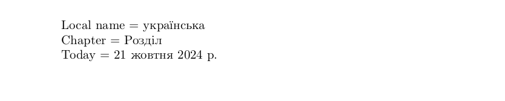

# Ukrainian

<blockquote>
  <p><em>Improve this page! Feel free to draft a pull request <a href="https://github.com/latex3/babel/tree/docs/docs">on GitHub</a></em>.</p>
</blockquote>

This page offers basic guidance on typesetting a LaTeX document in the
Ukrainian language using the Cyrillic script.

## Support with the traditional way (`ldf`)

The Ukrainian language is supported in `babel` in the ‘classical’ way
based on a `ldf` file. See [babel-ukrainian](https://ctan.org/pkg/babel-ukrainian)
for further details.

## Support with `ini` locale file

Here is a minimal sample file with `ukrainian` as the main language
(assuming `luatex`, which is the recommended engine, and `babel` ≥24.14,
although it may work with previous versions).

```tex
\documentclass[ukrainian]{article}

\usepackage[provide=*]{babel}

\babelfont{rm}{NewComputerModern10}

\begin{document}

Local name $=$ українська

Chapter $=$ \chaptername

Today $=$ \today

\end{document}
```

