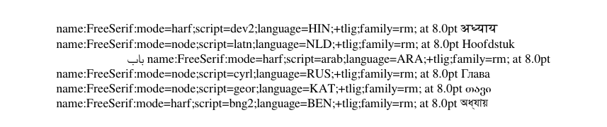

# What's new in babel 24.14

2024-11-30

<span style="color:red;">⚠</span> **This release introduces a couple of
potentially breaking changes.**

The revision of the documentation continues.

## Default renderer with `\babelfont`

**LuaLaTeX.** `Harfbuzz` is now the default renderer in most scripts,
except those of the ‘Greek family’, including Latin, Cyrillic,
Armenian and Georgian. In the rest of scripts, if there is any change
in the result it should be for the better. This is particularly true
for the Indic scripts, like Devanagari, Malayalam, Bangla, Tibetan,
etc., but also for RTL ones, like Arabic. (CJK is under study.)
[There is an exception. For compatibity issues, Arabic, Hebrew and
Syriac with `bidi-r` are still `Node`.]

There are two reasons to keep the default `Node` renderer in
those alphabetic scripts:
* Ligatures, kerning and the like are essential typographical features,
  and therefore the `luaotfload` tools to customize them should be
  directly available.
* There are some issues in the Harfbuzz renderer with relation to
  hyphenation. For example, many points are dropped if the font is
  heavily kerned, and explicit hyphens are mapped to the wrong Unicode
  character.

This feature applies to `\babelfont`. The standard calls to `fontspec`
are not touched, and `\defaultfontfeatures` is still fully functional
and it can be used to override the renderer chosen by `babel`.

The following example illustrates how `\babelfont` defines fonts based
on a generic declaration. `Babel` sets the script, the language, and
the renderer for you, thus easing the font handling in complex
multilingual documents:
```tex
\documentclass{article}

\usepackage[bidi=basic]{babel}
\babelfont{rm}{FreeSerif}

\begin{document}
\footnotesize
\selectlanguage{hindi} \fontname\font\ \chaptername\par
\selectlanguage{dutch} \fontname\font\ \chaptername\par
\selectlanguage{arabic} \fontname\font\ \chaptername\par
\selectlanguage{russian} \fontname\font\ \chaptername\par
\selectlanguage{georgian} \fontname\font\ \chaptername\par
\selectlanguage{bangla} \fontname\font\ \chaptername
\end{document}
```



## `import` in lazy loading

Lazy loading now has an implicit `import`. This is a requested feature,
and currently there are no real reasons for not to set date and
captions, for example. There were some restrictions in `pdftex` related
to font encodings, but they were lifted a few months ago.

Remember this behavior can be adjusted with `autoload.options` and
`autoload.bcp47.options` in `\babeladjust`.

**Note.** Just after uploading it to CTAN I discovered a bug — in some
  cases, `import` is not honored and it behaves in the old fashion. To
  be fixed in the next release.

## Changes in locale files

* **French.** Fix spacing with `punctuation.space` and successive ‘!’ and
  ‘?’. (Thanks to Daniel Flipo.)

* **Japanese.** As explained in [What’s new in babel
  24.11](https://latex3.github.io/babel/news/whats-new-in-babel-24.11.html),
  there were some pending tasks in a few languages related to transform
  variables. Now the `japanese` locale inserts the correct space with
  `linebreak.strict`, which is controlled with `small.natural`,
  `small.plus` and `small.minus`. They are set when the transform is
  activated to the `intraspace` values. In addition, the penalty, by
  default 10000, can be set with `small.penalty`.
  
## Fixes

* Issue with axis environment (tikz) in RTL context (graphics layout)
  (#318). Thanks to Salim Bou [@seloumi](https://github.com/seloumi).

