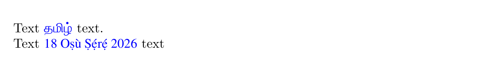

# What's new in babel 26.1

**Draft**

## Transforms

With `\babelposthyphenation` there was the possibility to declare rules
like `{a}$`, but not with `\babelprehyphenation` (you had to write
`(){a}()$`). Now the former syntax is allowed in both transforms.

## Kashida

The transform `kashida.base` has been much improved with the addition
of rules for explicit tatweels and more diacritics. The tatweel
priority is set to 300, that is, lower than the rest of characters,
which have priority 500.

In addition, very short lines are better dealt with. 

## `\otherlanguage*`

Many text commands also have a ‘declaration’ form. An example is
`\textit` and `\itshape`. The declaration forms can be appropriate in
some cases, but sadly the equivalent to `\foreignlanguage` didn’t exist. An
option was the environment `otherlanguage*`, but it was somewhat 
inconvenient, and using it as a macro required a low level hack. Now,
`\otherlanguage*` is a valid syntax. A minimal document showing it in
action is:
```tex
\documentclass[english]{article}

\usepackage{babel}
\babelfont[tamil, yoruba]{rm}{FreeSerif}[Color=blue]

\begin{document}

Text {\otherlanguage*{tamil}தமிழ்} text.

Text {\otherlanguage*[date]{yoruba}\today} text

\end{document}
```



## Fixes

* Extra `\else` and `\fi` since document last built (#382).
* Interaction of `onchar` option with tagging and unicode-math causes
  cryptic errors (#386).
* Wrong text direction in `tabular` if `array` is loaded after `babel`
  (#387).


=============
nofiles
\otherlanguage
{0000}

