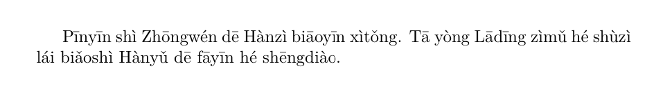
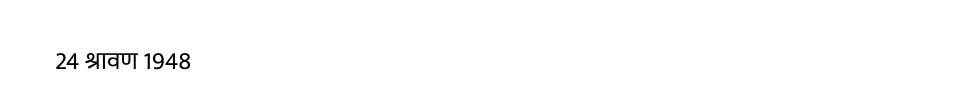

# What's new in babel 26.12

2026-09-09

The PDF with the manual is now partially tagged for accesibility.

## Pinyin

There is a new locale for Chinese pinyin. Its name, following the
conventions in [Locale
naming](https://latex3.github.io/babel/guides/locale-naming.html), is
`chinese-pinyin`. The BCP 47 tag, as recommended by the IANA, is
`zh-Latn-pinyin`.

Tone can me marked with numbers and converted to characters with
diacritics with the transform `tone.numeric`. For example:
```tex
\documentclass{article}

\usepackage[chinese-pinyin, provide={transforms=tone.numeric}]{babel}

\begin{document}

Pin1yin1 shi4 Zhong1wen2 de1 Han4zi4 biao1yin1 xi4tong3. Ta1 yong4
La1ding1 zi4mu3 he2 shu4zi4 lai2 biao3shi4 Han4yu3 de1 fa1yin1 he2
sheng1diao4.

\end{document}
```


## `\today` with external converters

Now they can be used when setting the default date format for the
locale. First, an example with the built-in converter in `babel`, with
the Indian National Calendar (`luatex` and `xetex`):
```tex
\documentclass{article}

% Set a fixed day for this example
\year=2026 \month=8 \day=15

\usepackage[hindi, provide={calendar=indian}]{babel}
\babelfont{rm}{Mukta}

\begin{document}

\today

\end{document}
```


And now with a converter from `calendrica`, which still uses the
strings for the `indian` calendar (only `luatex`):
```tex
\documentclass{article}

% Set a fixed day for this example
\year=2026 \month=8 \day=15

\usepackage[hindi, provide={calendar=indian.calendrica:hindu-solar}]{babel}
\babelfont{rm}{Mukta}

\begin{document}

\today

\end{document}
```


Using `calendrica` with the gregorian calendar strings is possible.
Just leave out the calendar name and keep the converter.

## Known issues

* `\\` between digits messes up the text direction. A workaround is
`\\\babelsublr{}`

## Fixes

* Wrong direction in `amstex` `\text` inside `\[`...`\]` in
  RTL mode.
  
 
