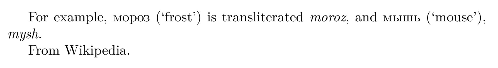

# What's new in babel 3.38

2020-01-15

## Automatic switching of locale and fonts (lua)

Sometimes, you need to insert short pieces of text in a different
script from the main one – for example, some Japanese words inside
Bulgarian. Now, identifiers (`\language` and `\localeid`, which apply
currently to line breaking) and fonts can be automatically set based on
script blocks, without explicit mark up (only `luatex`). A full example
is:

```tex
\documentclass{article}

% Load russian and english
\usepackage[russian,english]{babel}

% Switch \language and \localeid, and fonts with Russian chars
\babelprovide[onchar=ids fonts]{russian}

% Set font for russian, as the default one only covers the Latin
% script.
\babelfont[russian]{rm}{CMU Serif Roman}

\begin{document}

% Comment the following line out to see hyphenation points:
% \hsize1pt

For example, мороз (‘frost’) is transliterated \textit{moroz}, and мышь
(‘mouse’), \textit{mysh}.

From Wikipedia.

\end{document}
```



## Public access to locale info in `ini` files

Until now, the information in the `identification` section was stored in
‘private’ macros (ie, with `@`’s). Now, they are exposed with the command
`\localeinfo`, which is fully expandable, provided the value exists (it
raises an error otherwise). For example, to get the locale code:
```tex
\localeinfo{tag.bcp47}
```
See the manual for the full list.