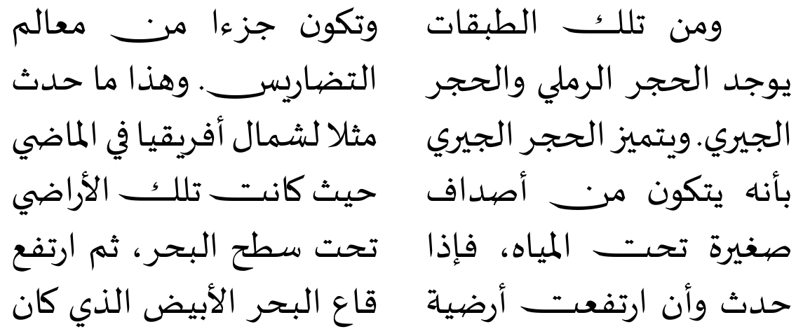

# What's new in babel 3.58

2021-04-26

## Transforms added to `ini` files

**Czech, Polish, Portuguese, Slovak, Spanish** ▸ `hyphen.repeat` ▸ Explicit hyphens behave like `\babelhyphen{repeat}`.

**Czech, Polish, Slovak** ▸  `oneletter.nobreak` ▸ Converts a space after a non-syllabic preposition or conjunction into a non-breaking space.

**Hindi, Sanskrit** ▸ `punctuation.space` ▸ Inserts a space before the following
four characters: `!?:;`. Added `transliteration.hk` for
Sanskrit, too.

**Norsk** ▸ `doubleletter.hyphen` ▸ Hyphenates the doble-letter groups `bb`, `dd`, `ff`, `gg`, `ll`, `mm`, `nn`, `pp`, `rr`, `ss`, `tt` as `bb-b`, `dd-d`, etc. 

**Serbian** ▸ `transliteration.gajica` ▸ (Note `serbian` with `ini` files refers to the Cyrillic script, which is here the target.) The standard system devised by Ljudevit Gaj. 

## Verbatim and `\babelprehyphenation`

⚠ Now `prehyphenation` transforms are deactivated if the current
hyphenation patterns are `nohyphenation`, so that they aren't applied
in verbatim mode.

This behavior can be switched with:
```
\babeladjust{ prehyphenation.disable = nohyphenation }
\babeladjust{ prehyphenation.disable = off }
```

## New line breaking mode

So far, `babel/lua` provided three line breaking modes in the `ini`
settings, for ‘hyphenated’ (the default), ‘CJK’ and ‘Southeast Asian’. A
new mode has been added for ‘unhyphenated’ languages, like Arabic or
Malayalam. It adjusts the paragraphs parameters to allow large spaces
between words.

Although for European standards the result may look odd, in some
scripts this has been the customary (although not always the desired)
practice. Because of that, no locale sets currently this mode by
default (Amharic is an exception). It works with `xetex`, too.

It can be activated in the following way:
```tex
\babelprovide[hyphenrules = unhyphenated]{<language>}
```
because the patterns so called set the line breaking mode to
‘unhyphenated’ (it also works the other way – setting the mode in the
`ini` file sets the hyphenrules).

So, currently there are two modes for scripts that separate words with
spaces, and two modes for scripts with no word separator. Further modes
could be added in the future, and there is work in progress for
‘Justification alternates’ and tatwil in Arabic (see below).

See also [here](whats-new-in-babel-3.57.md) for Uyghur hyphenation.

## Arabic justification (experimental)

There is some experimental code for Arabic justification, for
demonstration purposes (not really usable in real documents). The basic
code is based on the wonderful package `chickenize`, by Arno L.
Trautmann. Just the main font, no rules, brute force, direct 1-to-1
glyph replacements. All this will be sorted out later, as well as
support for kashida. Feel free to contribute and make suggestions.



The preamble used in the previous example is:
```tex
\documentclass{article}

\usepackage[arabic, provide=*, bidi=basic]{babel}

% A Windows font with jalt table. Also Arabic Typesetting.
\babelfont{rm}{Sakkal Majalla}% Windows font with jalt table.

\ArabicSetupJust
```
The last macro is temporary. It will be removed.

## Fixes

* `\shorthandoff*{^}` was not revertible (#126).
