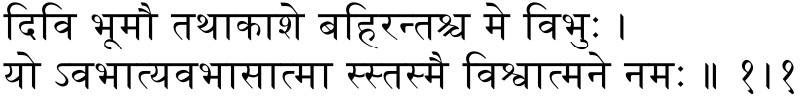

# What's new in babel 3.71

2022-02-13

⚠ Remember the `luatex` support for `amsmath` has not been finished.
Expect some anomalous vertical skips in displays (partly due to a bug
in luatex — a fix is on the way), even with the standard environments,
and misplaced tags in some cases (for example, with `aligned` and
`gathered`).

## IAST transliteration for Sanskrit

This feature has been contributed by Maximilian Mehner. See
[radardenker/babel-iast](https://github.com/radardenker/babel-iast).

Althought `babel` provided the Havard-Kyoto system, which requires only
ASCII characters, the IAST system is being far more commonly used these
days, thanks to Unicode.

The transliteration rules also standardize whitespace according to the
convention of Devanagari, in which — at least for Sanskrit — no
closing consonants are written with a stop sign if a vowel or consonant
follows in the sentence or verse line. So for example you would write
‘tat sad iti’ in IAST as well as Harvard-Kyoto, but the correct
Devanagari would be तत्सदिति all under one line giving the impression
of a single word. Most transliteration tools would transliterate ‘tat
sad iti’ to तत् सद् इति, so require you to input ‘tatsaditi’ to
achieve the correct output, but this is in itself a faulty
romanization.

Full stop (`.`) and slash (`/`) both get replaced by danda (`।`), two
of either by double-danda (`॥`). Colon (`:`) gets replaced by dash
(`–`) which is commonly used in Devanagari editions of dramas in this
function.
```tex
\documentclass{article}

\usepackage[english]{babel}

\babelprovide[import=sa, transforms=transliteration.iast]{iast}
\babelfont[iast]{rm}[Renderer=Harfbuzz]{DevanagariMT}
\setlength{\parindent}{0pt}

\begin{document}
\begin{otherlanguage}{iast}
  divi bhūmau tathākāśe bahir antaś ca me vibhuḥ /\\
  yo 'vabhāty avabhāsātmā ss tasmai viśvātmane namaḥ // 1.1
\end{otherlanguage}
\end{document}
```


## Fixes

* `provide+=*` didn’t work with `hebrew` as a secondary language.

* (lua) Wrong equation direction in 'cases' and 'array' (#167). The
  latter was a long standing problem, which was even mentioned as a
  known issue in the manual. Fixing it was not trivial, and a radically
  new approach to fix math typesetting in bidi texts, written in lua,
  has been devised. If it does the trick, this mechanism (which is
  similar to that already applied to `picture`, and part of the code is
  actually shared) will be fine tuned and extended in future releases.

* (lua) Bad interraction between `bidi` option and `mathtools`, which
  raised an error (#166). It’s related to the work in progress to
  improve math typesetting.
  


