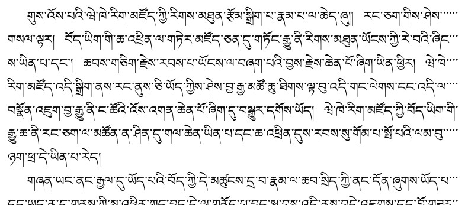

# What's new in babel 3.81

*Draft.*

## Tibetan line breaking and justification (`luatex`)

**Preliminary and tentative**

Please, feel free to contribute – feedback is most welcome.

This feature currently requires loading the language explicitly with
`\babelprovide`. Don’t use it for production.

The rules currently applied are the following (to be completed and
liable to change):

* Spaces are set to .5 em, ie, an en-space (but see below).
* Line breaking is allowed at spaces, except if between two shads.
* Line breaking is allowed after a tsheg (sometimes written tsek),
  except if followed by a shad (this rule must be fine tuned).
* Line breaking is allowed between a shad a consonant (to be fine
  tuned, too).
* Justification is done with lines padded with tshegs, if
  `justification=padding` is set.

Among others, there are no rules for *rin chen spungs shad* yet.

It’s worth noting the number of trailing tshegs can be dramatically
reduced with `microtype`, but this isn’t necessarily the desired
behavior.

There are a couple of Lua low-level parameter to adjust spacing (a higher
level will be provided in a future, besides some additional
parameters). The first one is the space in em units after a shad, an
the second one is the space after a tsheg. In both cases, it’s the
normal, plus and minus values. The values must be set with `\directlua`
(or some wrapper) in the preamble.
```
Babel.tibetan.shad = {.5, 0, 0}
Babel.tibetan.tsheg = {0, .0001, 0}
```  

Here is a sample document (text picked randomly from the Wikipedia)
with a Windows font:
```tex
\documentclass[twocolumn]{article}

\usepackage{babel}
\babelprovide[import, main, justification=padding]{tibetan}
\babelfont{rm}{Microsoft Himalaya}

\begin{document}

གུས་འོས་པའི་ཝེ་ཁེ་རིག་མཛོད་ཀྱི་རིགས་མཐུན་རྩོམ་སྒྲིག་པ་རྣམ་པ་ལ་ཆེད་ཞུ།།
རང་ཅག་གིས་ཤེས་གསལ་ལྟར།
བོད་ཡིག་གི་ཆ་འཕྲིན་ལ་གཏེར་མཛོད་ཅན་དུ་གཏོང་རྒྱུ་ནི་རིགས་མཐུན་ཡོངས་ཀྱི་རེ་བའི་ཞིང་ས་ཡིན་པ་དང་།
ཆབས་གཅིག་རྗེས་རབས་པ་ཡོངས་ལ་བཞག་པའི་བྱས་རྗེས་ཆེན་པོ་ཞིག་ཡིན་ཕྱིར།
ཝེ་ཁེ་རིག་མཛོད་འདི་སྒྲིག་ནས་རང་ནུས་ཅི་ཡོད་ཀྱིས་ཤེས་བྱ་རྒྱ་མཚོ་ཆུ་ཐིགས་ལྟ་བུ་འདི་གང་ལེགས་ངང་འདི་ལ་བསྣོན་འཇུག་བྱ་རྒྱུ་ནི་ང་ཚོའི་འོས་འགན་ཆེན་པོ་ཞིག་དུ་བསྒྱུར་དགོས་ཡོད།
ཝེ་ཁེ་རིག་མཛོད་ཀྱི་བོད་ཡིག་གི་རྒྱུ་ཆ་ནི་རང་ཅག་ལ་མཚོན་ན་ཤིན་དུ་གལ་ཆེན་ཡིན་པ་དང་ཆ་འཕྲིན་དུས་རབས་སུ་གོམ་པ་སྤོ་པའི་ལམ་བུ་ཉག་ཕྲ་དེ་ཡིན་པ་རེད།

གཞན་ཡང་ནང་རྒྱལ་དུ་ཡོད་པའི་བོད་ཀྱི་དེ་མཚུངས་དྲ་བ་རྣམ་ལ་ཆབ་སྲིད་ཀྱི་ནང་དོན་ཞུགས་ཡོད་པ་དང་ཡང་ན་དྲ་གནས་ཀྱི་ས་འཕྲིན་གང་བྱུང་དེ་ལ་གནོད་པ་བྱུང་སླ་བས་འདི་ནས་བདེ་འཇགས་དང་བློ་གཟུར་བོར་གནས་པའི་རིག་གནས་ཤེས་བྱ་སོགས་སྤེལ་པར་མཐུན་རྐྱེན་ལེགས་པོ་མཁྱོངས་ཡོད།
དེ་བས་མཐུན་རྐྱེན་བཟང་པོ་འདི་ཉིད་མཁོ་དང་བསྟུན་ནས་དམ་འཛིན་བྱ་རྒྱུར་ཀུན་ལ་འོས་འགན་ཡོད་པ་རེད།
ང་ཚོ་ནས་བཟུང་སྟེ་འགོ་བརྩམས་ནས་རིགས་མཐུན་གང་མང་འདིའི་ཕྱོགས་ལ་ཁ་སྣོན་རྒྱག་པའི་ལས་སུ་ཞུགས་པའི་རེ་སྐུལ་དང་བཅས།།
ནམ་ཡིན་ཡང་རང་གིས་རིག་གནས་འདི་ཉིད་མ་ཉམས་གོང་སྤེལ་དུ་གཏོང་རྒྱུ་དང་ཆ་འཕྲིན་དུས་རབས་འདི་ལ་བེད་དང་ལྡན་པའི་དོན་གཉེར་རྒྱུའི་འདུན་པ་དང་བཅས།
རིགས་མཐུན་ཡོངས་ལ་བཀྲ་ཤིས་བདེ་ལེགས་ཞུ།
ཞེས་བོད་ཀྱི་ཆ་འཕྲིན་ལག་རྩལ་པ་བསོད་ནམས་གངས་རྒྱན་ནས།

\end{document}
```


The algorithm devised for the Tibetan justification is based on that
for Arabic (remember the latter is usable in many cases but not
complete). 

There isn’t a single convention for Tibetan justification. Sometimes,
tshegs at the end of lines are omitted and inter-character spacing
adjusted. Some parameters will be provided to adjust the formatting.

**Resources**

* [Tibetan
  Line Breaking, Unicode Line Breaking Algorithm](https://www.unicode.org/reports/tr14/#TibetanLinebreaking)
* [Digital
Tibetan](https://digitaltibetan.github.io/DigitalTibetan/main.html)
* [Requirements for Tibetan Text Layout and
  Typography](https://www.w3.org/TR/tlreq/)
* [Tibetan (r12a)](https://r12a.github.io/scripts/tibetan/bo.html)

## New option `letters` for `onchar`

With this options, mapping is restricted to letters (in the TeX sense,
that is, with catcode 11), and other characters are excluded, including
digits. The main purpose of this option is to exclude from the Latin
script a good deal of characters which are best assigned to the main
font, like commas, colons, and so on. This rule based on catcodes is
simple and efficient. More complex rules should be handled with TeX
macros (for example, a `\enquote` can be defined for quoted English
text) or with transforms, but the latter must be extended before,
because currently it cannot deal with fonts.

A typical usage would be something like:
```tex
\usepackage[sinhala, provide=*]{babel}
\babelfont{rm}{FreeSerif}

\babelprovide[onchar=ids fonts letters]{english}
\babelfont[english]{rm}{Latin Modern Roman}
```

Bear in mind no universal rules can be settled and depends largely on
the document and the ‘semantic’ context. Consider the following
sentence:: “Οὐχὶ, ταὐτὰ, and παρίσταταί are the first words in this
text.” In this case the punctuation must be in the English font, and
the fact the first comma is placed between two Greek letters is
irrelevant. Although several criteria are possible, like the first
letter in the paragraph, the surrounding letters, and so on, manual
switching will be still necessary very often.

## Locales

* More updates to the CLDR 41: Burmese, Dutch, Kwasio, Malay, Marathi,
  Mazanderani, Nepali, Norwegian, Norwegian Nynorsk.

## `fontspec` warnings

After some attempts to deal with the `fontspec` warnings about
unavailable languages and scripts, now they are concealed when fonts are
defined with `\babelfont` (but not otherwise). In most cases they are
useless and even misleading, because many fonts don’t set the language
system, many people know nothing about this OpenType feature, and some
even think those warnings refer to the availability of the language in
`babel`.
