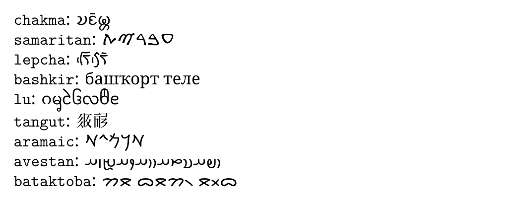

# What's new in babel 3.99

2023-12-10

## Fix

Spurious space in some cases because of a missing %, a bug introduced
in 3.98.

## New locales

There are two new locales:
[`chakma`](https://latex3.github.io/babel/guides/locale-chakma.html) and
[`lowgerman`](https://latex3.github.io/babel/guides/locale-lowgerman.html).

In addition, the following bare minimum locales have been added:

* [`aramaic`](https://latex3.github.io/babel/guides/locale-aramaic.html)
* [`avestan`](https://latex3.github.io/babel/guides/locale-avestan.html)
* [`aymara`](https://latex3.github.io/babel/guides/locale-aymara.html)
* [`bashkir`](https://latex3.github.io/babel/guides/locale-bashkir.html)
* [`bataktoba`](https://latex3.github.io/babel/guides/locale-bataktoba.html)
* [`bavarian`](https://latex3.github.io/babel/guides/locale-bavarian.html)
* [`classicalmandaic`](https://latex3.github.io/babel/guides/locale-classicalmandaic.html)
* [`ingush`](https://latex3.github.io/babel/guides/locale-ingush.html)
* [`komi`](https://latex3.github.io/babel/guides/locale-komi.html)
* [`lepcha`](https://latex3.github.io/babel/guides/locale-lepcha.html)
* [`limbu`](https://latex3.github.io/babel/guides/locale-limbu.html)
* [`lineara`](https://latex3.github.io/babel/guides/locale-lineara.html)
* [`lu`](https://latex3.github.io/babel/guides/locale-lu.html)
* [`makasar`](https://latex3.github.io/babel/guides/locale-makasar.html)
* [`samaritan`](https://latex3.github.io/babel/guides/locale-samaritan.html)
* [`sinteromani`](https://latex3.github.io/babel/guides/locale-sinteromani.html)
* [`tainua`](https://latex3.github.io/babel/guides/locale-tainua.html)
* [`tangut`](https://latex3.github.io/babel/guides/locale-tangut.html)
* [`waray`](https://latex3.github.io/babel/guides/locale-waray.html)

Most scripts in the Unicode basic plane are now covered with, at
least, a minimal locale.

Here is a sample, with `lualatex` and the Noto family:

```tex
\documentclass{article}

\usepackage[bidi=basic]{babel}

\usepackage{fontspec}
\defaultfontfeatures{Renderer=Harfbuzz}
\babelfont{rm}{NotoSerif-Regular.otf}
\babelfont[chakma]{rm}{NotoSansChakma-Regular.otf}
\babelfont[samaritan]{rm}{NotoSansSamaritan-Regular.otf}
\babelfont[lepcha]{rm}{NotoSansLepcha-Regular.otf}
\babelfont[lu]{rm}{NotoSansNewTaiLue-Regular.otf}
\babelfont[tangut]{rm}{NotoSerifTangut-Regular.otf}
\babelfont[aramaic]{rm}{NotoSansImperialAramaic-Regular.otf}
\babelfont[avestan]{rm}{NotoSansAvestan-Regular.otf}
\babelfont[bataktoba]{rm}{NotoSansBatak-Regular.otf}

\newcommand{\showname}[1]{%
  \par\texttt{#1}:
  \foreignlanguage{#1}{%
    \getlocaleproperty\result{#1}{identification/name.local}%
    \result}}

\begin{document}

\showname{chakma}
\showname{samaritan}
\showname{lepcha}
\showname{bashkir}
\showname{lu}
\showname{tangut}
\showname{aramaic}
\showname{avestan}
\showname{bataktoba}

\end{document}
```

