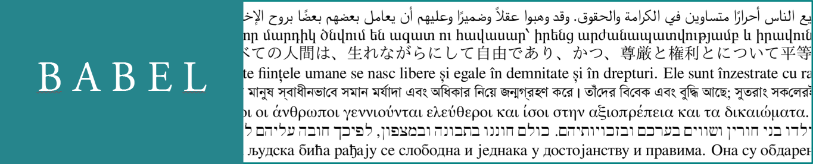

<b>Localization and internationalization ◾ pdfTeX, LuaTeX and XeTeX</b>

This is the home page for Babel, a multilingual environment for latex (and sometimes plain) for the three basic engines (pdfTeX, LuaTeX and XeTeX). Its aim is to provide a localization framework for different languages, scripts, and cultures based on the latest advances in Unicode and other technologies. 

-----------------------

## Featured 

* [Non-standard hyphenation with   luatex](guides/non-standard-hyphenation-with-luatex.md)
  Explains how to define special hyphenation rules like `ff` → `ff-f`
* [Useful links to   tex.strackexchange](guides/useful-links-to-tex.stackexchange.md)
  Examples for many languages: Chinese, Arabic, Sanskrit, etc.
* [Using \babelprovide to modify or extend locales](guides/using-babelprovide-to-modify-or-extend-locales.md)
  Hints on how to tailor your language to your needs in some frequent cases.
* [Which method for which language](guides/which-method-for-which-language.md)
  When to use the old good language files and when `\babelprovide` or `provide=*`.

---------------------------

## What's new 

| Version | Most relevant changes
| --- | --- |
| [3.58](news/whats-new-in-babel-3.58.md) | More transforms for Sanskrit, Polish, Czech, Serbian, etc.
| [3.57](news/whats-new-in-babel-3.57.md) | Predefined transforms for Arabic, Greek, Hungarian, etc.
| [3.56](news/whats-new-in-babel-3.56.md) | Transforms (in `ini` files) |
| [3.55](news/whats-new-in-babel-3.55.md) | Mainly internal changes. Captions in Uyghur. |
| [3.54](news/whats-new-in-babel-3.54.md) | Improved `picture`. |
| [3.53](news/whats-new-in-babel-3.53.md) | Templates in `\setlocalecaption`. Captions in Sinhala. |
| [3.52](news/whats-new-in-babel-3.52.md) | Improvements in `\babelprehyphenation` and `\babelposthyphenation`. |
| [3.51](news/whats-new-in-babel-3.51.md) | `\setlocalecaption`, to (re)define captions at the document level. |
| [3.50](news/whats-new-in-babel-3.50.md) | A bug fix release for 3.49. |
| [3.49](news/whats-new-in-babel-3.49.md) | `ini` files: enable standard LaTeX syntax as options; French spacing. |
| [3.48](news/whats-new-in-babel-3.48.md) | Preliminary tools for labels (for languages like Japanese and Hungarian). |
| [3.47](news/whats-new-in-babel-3.47.md) | ini+tex templates for about 500 languages.  |
| [3.46](news/whats-new-in-babel-3.46.md) | Option to select languages with BCP 47 tags. |
| [3.45](news/whats-new-in-babel-3.45.md) | Improvements in `\localedate`. |
| [3.44](news/whats-new-in-babel-3.44.md) | Argument in `\foreignlanguage` to switch date and/or captions. Amharic. |
| [3.43](news/whats-new-in-babel-3.43.md) | Autoloading based on BCP 47 codes. |
| [3.42](news/whats-new-in-babel-3.42.md) | `\getlanguageproperty`. Syriac, Coptic, Church Slavic. |
| [3.41](news/whats-new-in-babel-3.41.md) | Counters and numerals (alphabetic and additive). |
| [3.40](news/whats-new-in-babel-3.40.md) | Locale ini files for Latin and Greek. ‘Other’ characters in hyphenation patterns. |
| [3.39](news/whats-new-in-babel-3.39.md) | Locale loading on the fly. |
| [3.38](news/whats-new-in-babel-3.38.md) | Automatic switching of locale and fonts based on script (lua). |
| [3.37](news/whats-new-in-babel-3.37.md) | Non-standard hyphenation, like `f-f` → `ff-f` (lua). |
| [3.36](news/whats-new-in-babel-3.36.md) | Polytonic Greek. Improvements in Chinese. |
| [3.35](news/whats-new-in-babel-3.35.md) | Shorthands work in bibs and refs even with `safe=none`. |
