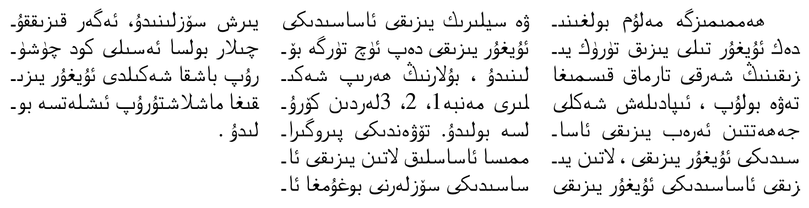

# What's new in babel 3.57

(*Under development.*)

## Transforms added to `ini` files

*Some of them are still experimental or incomplete.*

* **Arabic** `transliteration.dad` ▸ Applies the transliteration system
  devised by Yannis Haralambous for
  [`dad`](http://mirrors.ctan.org/language/arabic/dad/dad-user-guide.pdf).
  Not yet complete, but sufficient for many texts.

* **Croatian** `digraphs.ligatures` ▸ Ligatures *DŽ*, *Dž*,
*dž*, *LJ*, *Lj*, *lj*, *NJ*,
*Nj*, *nj*. It assumes they exist. This is not the
recommended way to make these transformations (the best way is with
OTF features), but it can get you out of a hurry.

* **Greek** `diaeresis.hyphen` ▸ Removes the diaeresis above iota and
upsilon if hyphenated just before. It works with the
three variants.

* **Hindi** `transliteration.hk` ▸ The Harvard-Kyoto system to romanize
Devanagari.

* **Hungarian** `digraphs.hyphen` ▸ Hyphenates the groups
*ccs*, *ddz*, *ggy*, *lly*, *nny*,
*ssz*, *tty* and *zzs* as *cs-cs*,
*dz-dz*, etc.

## Uyghur hyphenation (lua)

Some tentative code has been added to the Uyghur locale for the words
to be hyphenated correctly, preserving the joining forms. See
https://www.w3.org/TR/css-text-3/#word-break-shaping . It assumes the
basic forms (initial, medial, final). 

Here is an example (text from copypasted from
https://github.com/azmat21/Syllabification-for-Uyghur ).
```
\documentclass{article}

\usepackage[bidi=basic]{babel}

\usepackage{multicol}

\babelprovide[hyphenrules=+, main, import]{uyghur}

\babelfont{rm}
  [Renderer=Harfbuzz]
   % {Amiri}
   % {Arial}
   % {Arabic Typesetting}
   % {Scheherazade}
   {FreeSerif}
   % {Calibri}

\begin{document}

% A few basic patterns, with a somewhat crude rule.
\patterns{
3^^^^06284 3^^^^062a4 3^^^^062b4 3^^^^062c4 3^^^^062d4 3^^^^062e4
3^^^^062f4 3^^^^06314 3^^^^06324 3^^^^06333 3^^^^06334 3^^^^06344
3^^^^06354 3^^^^06364 3^^^^06374 3^^^^06384 3^^^^06394 3^^^^063a4
3^^^^06414 3^^^^06424 3^^^^06434 3^^^^06444 3^^^^06454 3^^^^06464
3^^^^06474 3^^^^064a4 3^^^^06864 3^^^^06ad4 3^^^^06af4 3^^^^06cb4
}

\begin{multicols}{3}
  % \hsize1pt

  ھەممىمىزگە مەلۇم بولغىنىدەك ئۇيغۇر تىلى يىزىق تۈرۈك يىزىقىنىڭ شەرقى
  تارماق قىسمىغا تەۋە بولۇپ ،  ئىپادىلەش شەكلى جەھەتتىن ئەرەب يىزىقى
  ئاساسىدىكى ئۇيغۇر يىزىقى ،  لاتىن يىزىقى ئاساسىدىكى ئۇيغۇر يىزىقى ۋە
  سيلىرىك يىزىقى ئاساسىدىكى ئ‍ۇيغۇر يىزىقى دەپ ئۈچ تۈرگە بۆلىنىدۇ ، 
  بۇلارنىڭ ھەرىپ شەكىلىرى مەنبە1، 2، 3لەردىن كۆرۇلسە بولىدۇ. تۆۋەندىكى
  پىروگىراممىسا ئاساسلىق لاتىن يىزىقى ئاساسىدىكى سۆزلەرنى بوغۇمغا ئايىرش
  سۆزلىنىدۇ،  ئەگەر قىزىققۇچىلار بولسا ئەسىلى كود چۈشۈرۇپ باشقا شەكىلدى
  ئ‍ۇيغۇر يىزىقىغا ماشلاشتۇرۇپ ئىشلەتسە بولىدۇ .
\end{multicols}

\end{document}
```




